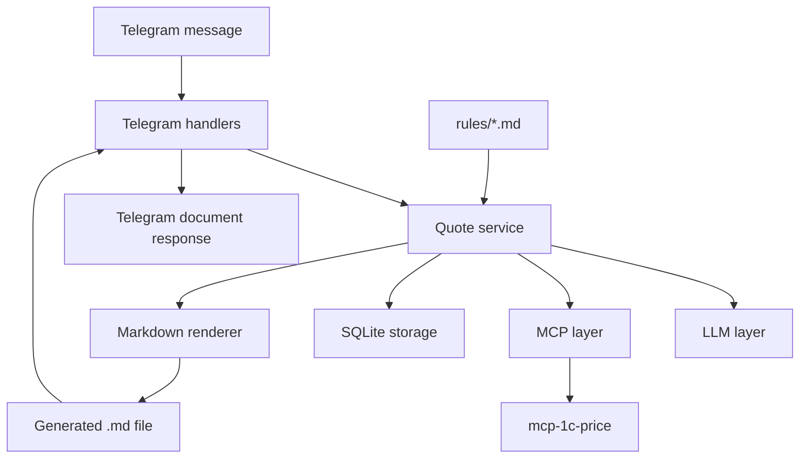

# Архитектура

## Обзор

Бот разделён на небольшие модули с понятными границами. Telegram handlers
отвечают только за входящие и исходящие сообщения. Оркестрация КП находится в
quote service. Внешние зависимости изолированы за LLM- и MCP-клиентами. SQLite
хранит устойчивое состояние. Runtime-правила в `rules/` дают LLM предметный
контекст. Renderer создаёт Markdown-файлы по шаблонам.

## Компоненты

### Telegram Layer

Telegram-слой получает команды и сообщения через aiogram long polling. Он
маршрутизирует `/start`, `/refresh_prices` и обычные текстовые сообщения в
прикладные сервисы, а затем отправляет менеджеру текстовые ответы или
сформированные файлы.

### Quote Service

Quote service управляет бизнес-сценарием:

1. Принять сообщение менеджера.
2. Загрузить или создать текущий черновик КП.
3. Загрузить Markdown-правила из `rules/`.
4. Попросить LLM-слой выбрать действие бота через structured tool/action
   selection.
5. Выполнить выбранное действие кодом приложения: прочитать SQLite, вызвать MCP,
   изменить черновик или сформировать файл.
6. Если действие требует работы с продуктами, попросить LLM-слой извлечь позиции
   и применить предметные правила из контекста.
7. Попросить MCP-слой найти продукты или собрать КП.
8. Решить, требуется ли уточнение.
9. Сохранить изменения черновика.
10. Сформировать и вернуть итоговый Markdown-файл, когда КП готово.

### LLM Layer

LLM-слой вызывает OpenRouter через API, совместимый с OpenAI. Конкретная модель
читается из конфигурации, поэтому её можно поменять без изменения кода.

LLM-слой отвечает за структурированную интерпретацию свободного текста
менеджера и простых Markdown-правил проекта, но не за прямой поиск цен.
Источник истины по продуктам и ценам — MCP.

LLM используется в два шага:

1. Tool/action selection — выбрать намерение менеджера и вернуть одно из
   действий, перечисленных в разделе `Supported LLM actions`.
2. Product extraction / quote reasoning — выполняется только для действий,
   которым нужны продукты, лицензии, апгрейды или бандлы.

LLM не ходит в SQLite, MCP или файловую систему напрямую. Она выбирает действие
и аргументы, а код приложения вызывает нужный repository, MCP client или
renderer.

LLM должна использовать правила из `rules/` как политику выбора сценария: новое
КП, работа с черновиками, апгрейд, предложение бандла, уточнение
неоднозначности или применение правил лицензирования.

#### LLM input contract

Для каждого обращения к LLM Quote service собирает контекст в таком порядке:

1. System instructions: роль бота, запрет придумывать продукты и цены, требование
   возвращать JSON для action selection.
2. Runtime rules: содержимое всех Markdown-файлов из `RULES_DIR`.
3. Draft state: компактная сериализация активного черновика, включая `id`,
   `status`, `title`, `client_name`, `clarification_question`,
   `clarification_kind` и позиции с `source_query`, `qty`, выбранным продуктом,
   ценой, суммой, НДС и статусом.
4. Conversation history: последние 10 сообщений текущего разговора из
   `messages`, отсортированные по времени.
5. Current user message: текущее сообщение менеджера.

LLM не получает полный прайс и не получает все черновики пользователя, пока
само выбранное действие не требует чтения черновиков через repository.

#### LLM output contract

В v1 action selection возвращается как JSON response в тексте ответа модели, а
не через tool/function calling. Ответ должен быть валидным JSON-объектом:

```json
{
  "action": "add_items",
  "arguments": {
    "items_text": "ERP, 150 лицензий"
  },
  "reason": "Менеджер просит добавить продуктовые позиции в расчёт."
}
```

`action` должен входить в список `Supported LLM actions`. `arguments` должны
соответствовать выбранному действию. `reason` — короткое диагностическое
объяснение для логов и отладки; бизнес-логика не должна зависеть от него.

Если ответ модели не является валидным JSON, содержит неизвестное действие или
невалидные аргументы, Quote service сохраняет сообщение, не выполняет
прикладных изменений и просит менеджера уточнить запрос.

#### Supported LLM actions

Для шага tool/action selection в v1 поддерживается фиксированный набор действий.
LLM возвращает только имя действия и аргументы, а код приложения выполняет само
действие через repository, MCP client или renderer.

- `list_drafts` — показать незавершённые черновики текущего Telegram-пользователя.
  Аргументы: `{}`.
- `find_drafts` — найти незавершённые черновики пользователя по текстовому
  запросу. Аргументы: `{"query": "ERP"}`.
- `open_draft` — открыть существующий черновик и связать его с текущим
  разговором. Аргументы: `{"draft_id": 12}`.
- `add_items` — добавить позиции в текущий черновик или создать новый черновик,
  если активного нет. Аргументы: `{"items_text": "ERP, 150 лицензий"}`.
- `replace_item` — заменить позицию в текущем черновике. Аргументы:
  `{"target": "бухгалтерия", "replacement_text": "базовая"}`.
- `remove_item` — убрать позицию из текущего черновика. Аргументы:
  `{"target": "ЗУП"}`.
- `new_calculation` — заменить текущий незавершённый расчёт новым, если менеджер
  явно просит посчитать другой набор продуктов. Аргументы:
  `{"items_text": "УХ на 500 пользователей"}`.
- `create_quote_file` — сформировать Markdown КП по текущему черновику.
  Аргументы: `{}` или `{"client_name": "ООО Ромашка"}`.
- `refresh_prices` — обновить локальную базу цен MCP. Аргументы: `{}`.
- `clarify_answer` — обработать ответ менеджера на ранее заданное уточнение.
  Аргументы: `{"answer": "КОРП"}`.

Если LLM возвращает неизвестное действие или аргументы не проходят валидацию,
Quote service не выполняет операцию и просит менеджера уточнить запрос.

### MCP Layer

MCP-слой запускает или подключается к внешнему серверу `mcp-1c-price` через
stdio и предоставляет типизированные вызовы:

- `search_products`
- `get_product`
- `build_quote`
- `refresh_prices`

Этот слой скрывает транспортные детали от остального приложения.

В v1 бот запускает MCP-сервер как subprocess при старте приложения. Путь к
серверу берётся из `MCP_SERVER_PATH`, транспорт — `stdio`. Если MCP недоступен
при старте или во время вызова инструмента, бот сообщает менеджеру понятную
ошибку и не сохраняет частично изменённый черновик. Следующий запрос к ценам
должен пересоздать MCP client/subprocess.

### Rules / Knowledge Base Layer

Rules-слой читает простые Markdown-файлы из корневой директории `rules/` и
передаёт их Quote service как runtime-контекст для LLM. Эти файлы являются
частью поведения приложения, а не только документацией.

Правила в `rules/` пишутся как человекочитаемые инструкции для промпта, а не
как строгая формальная спецификация или источник неизменяемых бизнес-инвариантов.
Их формулировки могут быть примерными и предметными: например, правило может
описать, когда LLM следует предпочесть КОРП-позиции, предложить апгрейд или
спросить уточнение. Точные приёмочные границы, если они критичны для разработки,
должны фиксироваться отдельно в OpenSpec capability specs, ADR или тестовых
сценариях.

Планируемые файлы правил:

- `rules/licensing.md` — правила лицензирования, редакций ПРОФ/КОРП, серверов и
  количества пользователей.
- `rules/upgrades.md` — правила апгрейдов и допустимых направлений перехода.
- `rules/bundles.md` — правила предложения готовых комплектов вместо сборки по
  компонентам.
- `rules/quote-behavior.md` — человекочитаемые правила поведения бота: когда
  работать с черновиками, когда менять текущий расчёт, когда формировать КП и
  когда задавать уточнение. Технический словарь LLM actions хранится в
  архитектуре, а не в `rules/`.

В v1 правила пишутся на русском языке в свободном Markdown-формате. Строгий DSL
или отдельный rule engine намеренно не вводятся. Код приложения не должен
парсить эти файлы как нормативную схему; он загружает их как текстовый контекст
для LLM и затем проверяет продукты и цены через MCP.

### Storage Layer

Storage-слой использует SQLite для локального устойчивого состояния:

- Пользователи Telegram.
- Входящие и исходящие сообщения.
- Черновики КП.
- Позиции черновика и выбранные продукты.
- Активный черновик текущего разговора.

В v1 storage намеренно остаётся локальным. Так как Telegram layer работает на
async `aiogram`, storage использует `aiosqlite`. На каждом соединении
применяются PRAGMA из `docs/database.md`.

### Renderer

Renderer загружает Jinja2-шаблон Markdown и записывает сформированное КП в
настроенную директорию вывода. Telegram handlers отправляют этот файл как
документ.

В v1 используется один шаблон: `templates/quote.md.j2`. Минимальная структура КП:
клиент, дата генерации, таблица с кодом, названием, количеством, ценой, суммой и
НДС, итог и короткое примечание.

### Code Structure

- `price_bot.bot` — Telegram handlers и запуск long polling.
- `price_bot.quotes` — Quote service, orchestration и сценарии КП.
- `price_bot.llm` — OpenRouter client, prompt сборка и JSON response parsing.
- `price_bot.mcp` — MCP subprocess/client и adapter contract.
- `price_bot.storage` — `aiosqlite` repositories и миграции SQLite.
- `price_bot.common` — конфигурация, ошибки и общие типы.

## Поток данных


