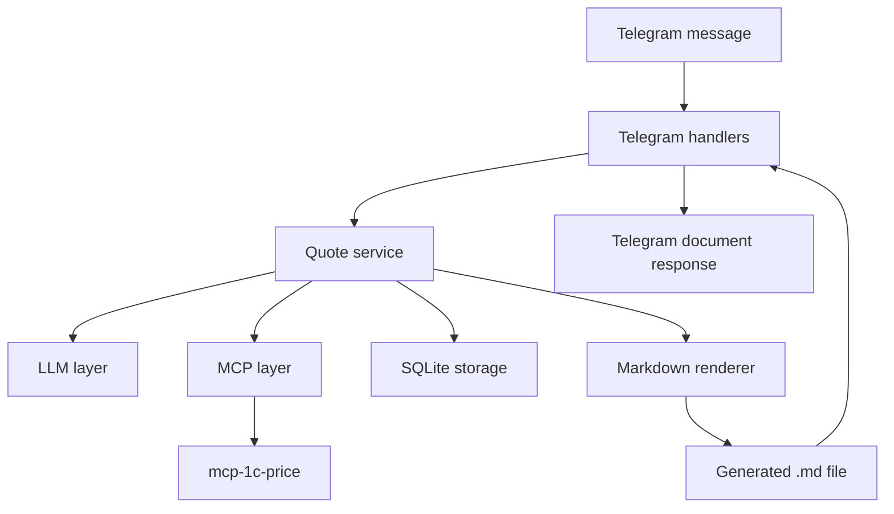

# Architecture

## Overview

The bot is split into small modules with clear boundaries. Telegram handlers
handle chat input and output only. Quote orchestration lives in the quote
service. External dependencies are isolated behind LLM and MCP clients. SQLite
stores durable state. The renderer creates Markdown files from templates.

## Components

### Telegram Layer

The Telegram layer receives commands and messages through aiogram long polling.
It routes `/start`, `/refresh_prices`, and regular text messages to application
services, then sends text replies or generated files back to the manager.

### Quote Service

The quote service owns the business flow:

1. Accept a manager message.
2. Load or create the current quote draft.
3. Ask the LLM layer to extract requested positions or interpret a clarification.
4. Ask the MCP layer to search products or build a quote.
5. Decide whether clarification is required.
6. Save draft changes.
7. Render and return the final Markdown file when the quote is ready.

### LLM Layer

The LLM layer calls OpenRouter through an OpenAI-compatible API. The concrete
model is read from configuration, so changing the model does not require code
changes.

The LLM layer is responsible for structured interpretation of free-form manager
text, not for direct price lookup. Price truth comes from MCP.

### MCP Layer

The MCP layer launches or connects to the external `mcp-1c-price` server over
stdio and exposes typed calls for:

- `search_products`
- `get_product`
- `build_quote`
- `refresh_prices`

This layer hides transport details from the rest of the application.

### Storage Layer

The storage layer uses SQLite for local durable state:

- Telegram users.
- Incoming and outgoing messages.
- Quote drafts.
- Draft positions and selected products.

The storage layer is intentionally local-only for v1.

### Renderer

The renderer loads a Jinja2 Markdown template and writes a generated commercial
offer file to the configured output directory. Telegram handlers send that file
as a document.

## Data Flow

