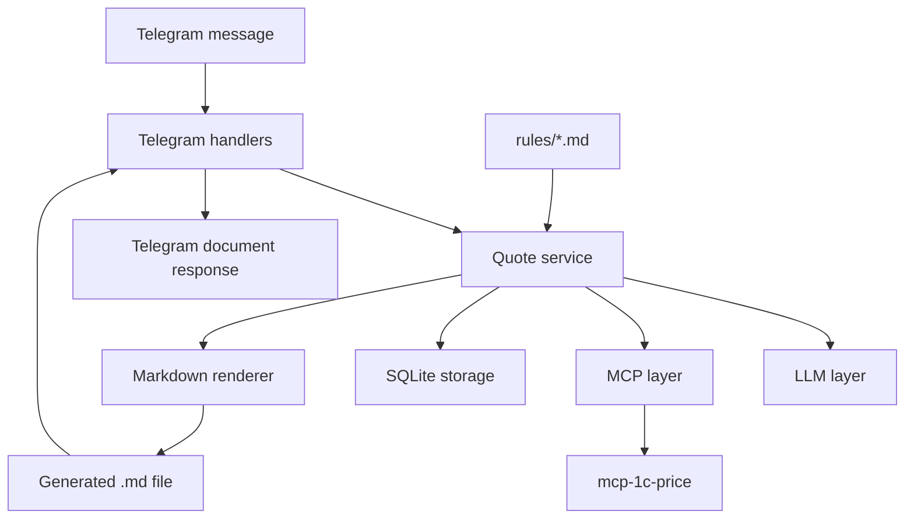

# Архитектура

## Обзор

Бот разделён на небольшие модули с понятными границами. Telegram handlers
отвечают только за входящие и исходящие сообщения. Оркестрация КП находится в
quote service. Внешние зависимости изолированы за LLM- и MCP-клиентами. SQLite
хранит устойчивое состояние. Runtime-правила в `rules/` дают LLM предметный
контекст. Renderer создаёт Markdown-файлы по шаблонам.

## Компоненты

### Telegram Layer

Telegram-слой получает команды и сообщения через aiogram long polling. Он
маршрутизирует `/start`, `/refresh_prices` и обычные текстовые сообщения в
прикладные сервисы, а затем отправляет менеджеру текстовые ответы или
сформированные файлы.

### Quote Service

Quote service управляет бизнес-сценарием:

1. Принять сообщение менеджера.
2. Загрузить или создать текущий черновик КП.
3. Загрузить Markdown-правила из `rules/`.
4. Попросить LLM-слой извлечь нужные позиции, разобрать уточнение и применить
   предметные правила из контекста.
5. Попросить MCP-слой найти продукты или собрать КП.
6. Решить, требуется ли уточнение.
7. Сохранить изменения черновика.
8. Сформировать и вернуть итоговый Markdown-файл, когда КП готово.

### LLM Layer

LLM-слой вызывает OpenRouter через API, совместимый с OpenAI. Конкретная модель
читается из конфигурации, поэтому её можно поменять без изменения кода.

LLM-слой отвечает за структурированную интерпретацию свободного текста
менеджера и простых Markdown-правил проекта, но не за прямой поиск цен.
Источник истины по продуктам и ценам — MCP.

LLM должна использовать правила из `rules/` как контекст для выбора сценария:
новое КП, апгрейд, предложение бандла, уточнение неоднозначности или применение
правил лицензирования.

### MCP Layer

MCP-слой запускает или подключается к внешнему серверу `mcp-1c-price` через
stdio и предоставляет типизированные вызовы:

- `search_products`
- `get_product`
- `build_quote`
- `refresh_prices`

Этот слой скрывает транспортные детали от остального приложения.

### Rules / Knowledge Base Layer

Rules-слой читает простые Markdown-файлы из корневой директории `rules/` и
передаёт их Quote service как runtime-контекст для LLM. Эти файлы являются
частью поведения приложения, а не только документацией.

Планируемые файлы правил:

- `rules/licensing.md` — правила лицензирования, редакций ПРОФ/КОРП, серверов и
  количества пользователей.
- `rules/upgrades.md` — правила апгрейдов и допустимых направлений перехода.
- `rules/bundles.md` — правила предложения готовых комплектов вместо сборки по
  компонентам.
- `rules/quote-behavior.md` — правила поведения бота при неоднозначностях,
  уточнениях и проверке результата.

В v1 правила пишутся на русском языке в свободном Markdown-формате. Строгий DSL
или отдельный rule engine намеренно не вводятся.

### Storage Layer

Storage-слой использует SQLite для локального устойчивого состояния:

- Пользователи Telegram.
- Входящие и исходящие сообщения.
- Черновики КП.
- Позиции черновика и выбранные продукты.

В v1 storage намеренно остаётся локальным.

### Renderer

Renderer загружает Jinja2-шаблон Markdown и записывает сформированное КП в
настроенную директорию вывода. Telegram handlers отправляют этот файл как
документ.

## Поток данных

